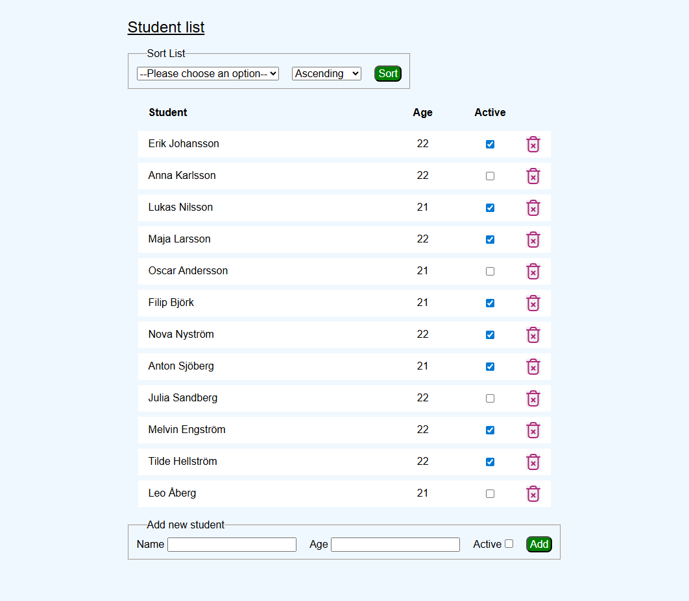

# Agile Student Catalog Group 4

This repository contains the code for a student catalog Typescript application, which was a group exercise in using agile development.

## Contents

- [Overview](#overview)
- [Installation](#installation)
- [Usage](#usage)
- [Contributing](#contributing)
- [License](#license)

## Overview

The Agile Student Catalog Group 4 project aims to provide a simple application for managing student data. The application allows users to view and manage lists of students, including their ID, name, age, and active status.



## Installation

1. **Clone the Repository:**

   ```bash
   git clone https://github.com/jplimmer/agile-studentcatalog-group4.git
   ```

2. **Navigate to the Directory:**

   ```bash
   cd agile-studentcatalog-group4
   ```

3. **Install Dependencies:**

   ```bash
   npm install
   ```

## Usage

1. **Start the Development Server:**

   ```bash
   npm run dev
   ```

2. **Access the Application:**

   Open a web browser and navigate to `http://localhost:5000`. You should see the student catalog application.

## Contributing

We welcome contributions! To get started, follow these steps:

1. Fork the repository.
2. Create a new feature branch.

   ```bash
   git checkout -b my-feature-branch
   ```

3. Make your changes and commit them.

   ```bash
   git add .
   git commit -m "Add my new feature"
   ```

4. Push your changes to your fork.

   ```bash
   git push origin my-feature-branch
   ```

5. Create a pull request on the original repository.

## License

This project is licensed under the MIT license. See the [LICENSE] file for details.
